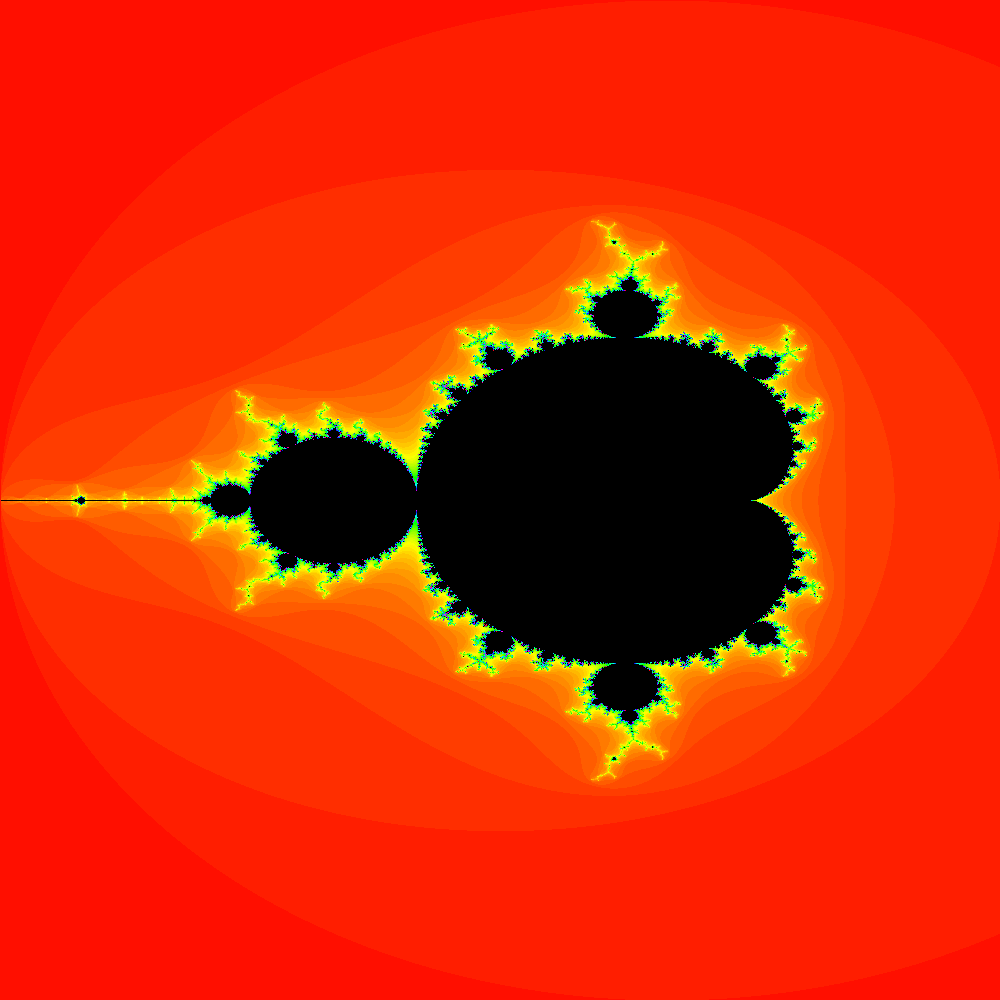

# A GoLang implementation to Generate Mandelbrot set Image

## Goal
- Understand golang's trace profiling tool and impact of goroutines on performance

## How to run
1. `go mod vendor`
2. `go build`
3. `./mandelbrot-set -mode seq`

### Looking at the Trace Profile
1. `go tool trace trace.out`

### Modes
- There are 3 different modes that you can choose from to generate the image
1. `seq`: sequentially calculate each pixel
2. `px`: spawns a new go routine per pixel  
3. `row`: spawns a new go routine per row of the image

### Other flags
- Use `./mandelbrot-set -help` command to know about available flags

## Example Generated Image
